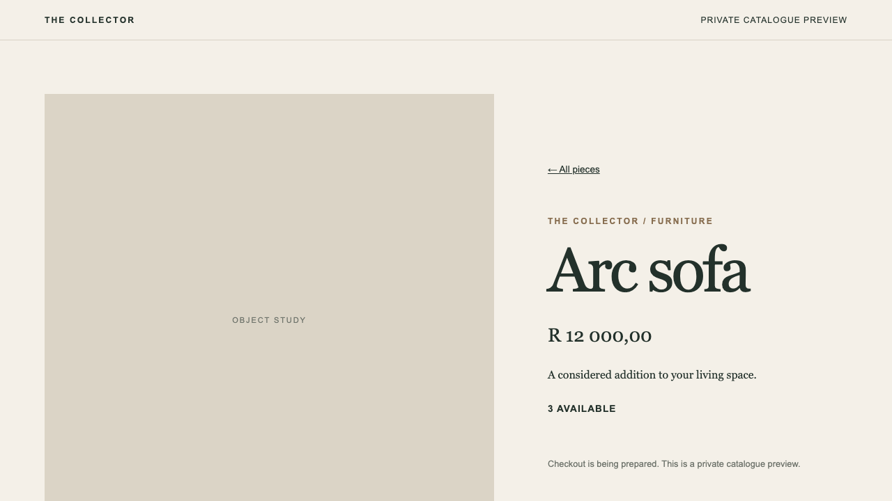

# Issue 743 local walkthrough

Disposable local infrastructure: Firstout PostgreSQL on port 5433, Medusa
PostgreSQL on port 5434, Redis on port 6379. Firstout ran on 8003, Medusa on
9000 and Next.js on 3004. All databases and credentials were local test data.

1. Firstout SKU `ARC-001` was published through the staff API. Its versioned
   Ops response contained only source ID, SKU, name, VAT-inclusive ZAR cents,
   quantity, revision and observation timestamp. The separate Medusa sync
   created handle `firstout-<source UUID>` and a ZAR product variant.
2. Chromium loaded the catalogue and clicked the Arc sofa product route.
   The page displayed R11,500 and two available. After a Firstout staff price
   change to R12,000 and a stock adjustment to three, the next sync and page
   request displayed R12,000 and three available. No browser request went to
   Firstout.
3. Unpublishing the test SKU and syncing returned HTTP 404 at its direct
   Storefront route. A bad machine token returned 401 from Ops. Republishing
   and syncing restored HTTP 200. The two-database contract test separately
   denied a first-instance credential and company ID on a second real
   PostgreSQL-backed Firstout instance.
4. `npx playwright test --config apps/storefront/web/playwright.config.ts`
   passed both Chromium tests: published product navigation and unknown-SKU
   direct 404. `uv run pytest -ra` in Firstout passed 613 tests. Medusa and
   Next production builds, both TypeScript checks, Ruff and ESLint passed.

Repeat the live parity check with the environment variables in
`apps/storefront/README.md` and `npx nx run storefront-commerce:integration`.
The browser test needs `STOREFRONT_TEST_SKU_ID`; it skips the published-product
case when no seeded SKU is supplied.
