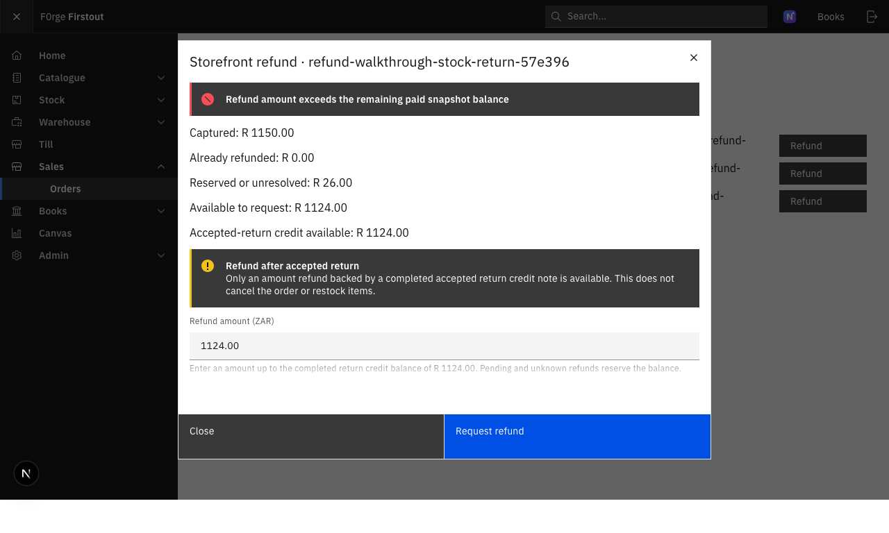
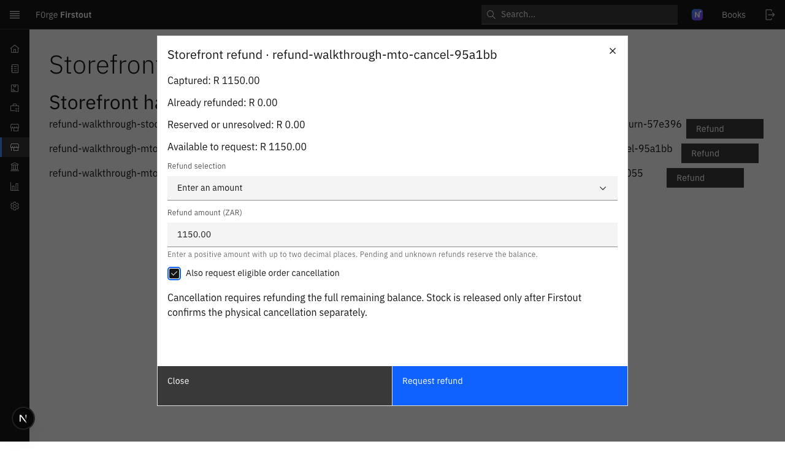

# #754 staff refund walkthrough

Date: 2026-10-02. This walkthrough used headless Chromium with Playwright against the local Firstout staff UI (`127.0.0.1:3003`) and isolated Firstout API/database (`127.0.0.1:18003`). It used only seeded synthetic staff and handoff fixtures. No credentials or customer data are recorded here.

## Results

**27 assertions passed:** 11 Books route/refund-control, cap, UI request, and idempotency checks; 6 stale-balance concurrency/error-display checks; and 10 selected-line, cancellation, and Till-permission checks.

- A Books-role user had `sales.refunds` without `sales.orders`. `/orders` showed the refund-only heading and refund actions. The invoice-with-accepted-return flow exposed amount entry only; it had no line-selection or cancellation controls. Entering R 1,150.01 against the R 1,150.00 credit cap disabled submission. An over-cap API request returned HTTP 400 and did not add a refund row.
- Submitting R 5.00 through the real UI returned HTTP 200 with `requested` status. Replaying the captured request with its same idempotency key returned the same refund ID; the initial allocation remained exactly 500 minor units.
- After a concurrent local reservation changed the available balance, submitting the previously displayed amount returned HTTP 400. The staff modal rendered the backend message, “Refund amount exceeds the remaining paid snapshot balance,” in an error notification. A later over-cap API probe also returned HTTP 400 with the fixture row count unchanged.
- On a separate pre-invoice fixture, selecting a line quantity of 1 produced a positive preview. Selecting the full remaining R 1,150.00 and requesting cancellation returned HTTP 200 with `requested` status; the API showed all 115,000 minor units reserved while cancellation remained unconfirmed.
- A Till-role user lacked `sales.refunds`, saw the ordinary Sales orders screen with no Refund buttons, and received HTTP 403 on a direct refund POST. The denied call added no intent.

Accepted local requests remain pending in the isolated test database: three on the pre-invoice line fixture (15,500 minor units total), six on the invoice fixture (2,700 minor units total), and one full cancellation request (115,000 minor units). These include concurrency probes used to exercise balance reservation. The line and invoice probes were not submitted to a provider. No local Medusa/commerce dispatcher was running, and no Peach secret, provider call, or remote infrastructure was used. The test left no confirmed refund or physical cancellation.

The browser run reported no page errors or HTTP 5xx responses. The backend owner’s sanitized checks during the walkthrough reported no 5xx or traceback; request-log details are omitted.

Screenshots captured under `/private/tmp` (synthetic fixture labels only): `754-final-books-orders.png`, `754-final-invoice-overcap.png`, `754-final-invoice-pending.png`, `754-final-stale-error.png`, `754-final-selected-line.png`, `754-final-cancel-form.png`, and `754-final-till-denied.png`.

Two representative screenshots are retained with this record:

