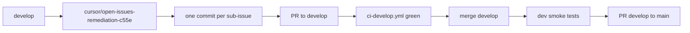

# Open issues remediation plan

> **Status:** Awaiting GitHub Issues API access. Run `./scripts/group-open-issues.sh` to create the parent issue, link sub-issues, and regenerate this file with the live issue list.

**Parent issue:** _(pending — script creates #TBD)_  
**Branch:** `cursor/open-issues-remediation-c55e` (off `develop`)  
**Repo:** [leothesouthafrican/health-tracker](https://github.com/leothesouthafrican/health-tracker)

## Blocker: Issues API permission

The Cursor GitHub App token in this environment returns `403 Resource not accessible by integration` for Issues read/write. Before implementation proceeds:

1. GitHub → **Settings** → **Applications** → **Cursor** → **Configure**
2. Under **Repository access**, ensure `health-tracker` is listed
3. Enable **Issues: Read and write**
4. Re-run the cloud agent or execute locally:

```bash
chmod +x scripts/group-open-issues.sh
./scripts/group-open-issues.sh
```

The script will:
- Create parent issue **"Open issues remediation bundle"**
- Link every open issue as a **sub-issue** (GitHub REST `POST /issues/{parent}/sub_issues`)
- Regenerate this plan with per-issue agent assignments and commit order

---

## Workflow



### Branch setup (start of implementation)

```bash
git fetch origin develop
git checkout develop && git pull origin develop
git checkout -b cursor/open-issues-remediation-c55e
```

### Commit convention

One atomic commit per sub-issue, ordered by dependencies (`Blocked by:` in each issue body):

```
fix(scope): short description (#NN)
feat(scope): short description (#NN)
```

Use `Closes #NN` or `Fixes #NN` in the commit body footer when the fix fully resolves the sub-issue.

### CI gates

| Stage | Workflow | Checks |
|-------|----------|--------|
| PR → `develop` | `.github/workflows/ci-develop.yml` | ruff check + format, pytest, frontend lint/typecheck/build |
| PR → `main` | `.github/workflows/ci-main.yml` | same + prod-shaped frontend build |

### Dev smoke tests (required after merge to `develop`, before PR to `main`)

Target: https://health-dev.leo-figueiredo.com (API: https://health-dev-api.leo-figueiredo.com)

| # | Check | How |
|---|-------|-----|
| 1 | Health | `curl -sf https://health-dev-api.leo-figueiredo.com/api/v1/health` |
| 2 | Auth | PIN login; confirm `ht_session` cookie |
| 3 | Golden paths | Drive each sub-issue fix in the browser (not just pytest) |
| 4 | Logs | Tail dev backend container logs during test window — no 500s behind toasts |
| 5 | Migrations | If any: `SELECT version_num FROM alembic_version` on dev Postgres |
| 6 | QA gate | `qa-engineer` agent produces QA Gate Report with **VERDICT: PASS** |

Known dev noise (do not fail on): vault-write warnings (`VAULT_PATH=""`), PWA icon 404, `/auth/me` 401 before login.

---

## Sub-agent delegation

Every issue follows the structure in root `CLAUDE.md` § "Writing issues for sub-agents". Agents read `.claude/projects/-Users-leo-development-health-tracker/memory/` before starting.

| Agent | Scope | Playbook |
|-------|-------|----------|
| `fastapi-backend` | Routers, services, schemas, models, migrations, API | `.claude/agents/fastapi-backend.md`, `.claude/review-context/fastapi-backend-playbook.md` |
| `frontend-dev` | React/Next.js UI, hooks, styles | `.claude/agents/frontend-dev.md`, `.claude/review-context/frontend-dev-playbook.md` |
| `data-engineer` | Ingredient DB, ETL, seeds, normalization | `.claude/agents/data-engineer.md` |
| `data-scientist` | LLM prompts, embeddings, dietary classification | `.claude/agents/data-scientist.md` |
| `devops` | Docker, Coolify, CI, Pi ports, Cloudflare | `.claude/agents/devops.md`, `.claude/review-context/devops-playbook.md` |
| `qa-engineer` | Final gate: static analysis, tests, live walkthrough, dev smoke | `.claude/agents/qa-engineer.md`, `.claude/review-context/qa-engineer-playbook.md` |

### Per-issue agent pattern

```
1. Planning pass (orchestrator reads issue body + diffs dependencies)
2. Implementing agent(s) — parallel only when files don't overlap
3. qa-engineer — local gate on branch
4. Commit with (#NN) reference
5. Repeat for next issue
```

### Routing heuristics (used by `group-open-issues.sh` when regenerating)

| Signal | Primary agent |
|--------|---------------|
| `backend/`, routers, alembic, migrations | `fastapi-backend` |
| `frontend/`, UI, checkin, customize | `frontend-dev` |
| ingredient JSON, FODMAP/histamine data, seeds | `data-engineer` |
| OpenRouter, embeddings, vision prompts | `data-scientist` |
| `docker-compose`, Coolify, `.github/workflows` | `devops` |
| Every issue | `qa-engineer` (gate, last) |

---

## Issues (execution order)

_Regenerated by `./scripts/group-open-issues.sh` once Issues API is available._

<!-- OPEN_ISSUES_TABLE -->

---

## Boundaries

**Always (no approval):**
- Branch off up-to-date `develop`
- One commit per sub-issue on `cursor/open-issues-remediation-c55e`
- Run `ruff check`, `pytest`, `npm run lint`, `npm run build` before each push
- Delegate to the correct sub-agent per issue scope

**Ask first:**
- Prod DB backfills or destructive migrations
- Coolify env var changes on Pi
- Dropping legacy columns
- Force-push or rewriting published commits

**Never:**
- `--no-verify` or skip hooks
- Secrets in code
- Skip dev smoke tests before opening PR to `main`
- Bundle unrelated issues in one commit

---

## Rollback

If a sub-issue fix causes regression after merge to `develop`:

1. Revert the specific commit: `git revert <sha>`
2. Push to `develop`; confirm CI green
3. Re-run dev smoke on affected paths
4. Re-open or comment on the sub-issue with findings

If regression reaches prod (should not — main PR is human-gated):

1. Revert the promote PR on `main`
2. Cherry-pick revert to `develop`
3. Coolify redeploy from `main`
